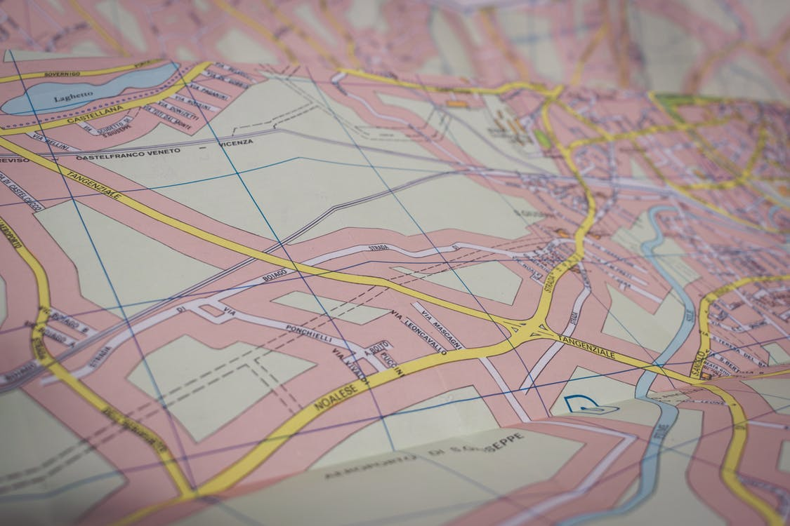

# Mapsistan

Mapsistan is a large country, and it is probably the country with the largest
number of cities in the world. As a result, the Public Roads Administration of
Mapsistan has a hard time keeping track of which cities are reachable from one
another through their huge road network. You, an expensive consultant, have
been hired to deal with this problem. 

They have managed to compile a list of every single road in the country, all of
which go between exactly two cities. The list as been written to
[a file](./input), where each city has been given an index in the range `[0,n)`.
The file begins with a line `n m`. Here, `n` is the number of cities in
Mapsistan, and `m` is the number of roads. Afterwards, there are `m` lines on
the form `i j`, where `i` and `j` are city indexes. Such a line indicates that
there is a bidirectional road between city `i` and `j`.

We say that two cities are connected if it is possible to reach one from the
other by using any number of roads between them.

In Mapsistan, all roads cost the same to build, no matter the length. Thus, the
goal is to build as few roads as possible. What is the least number of new
roads needed to connect all the cities of Mapsistan?
