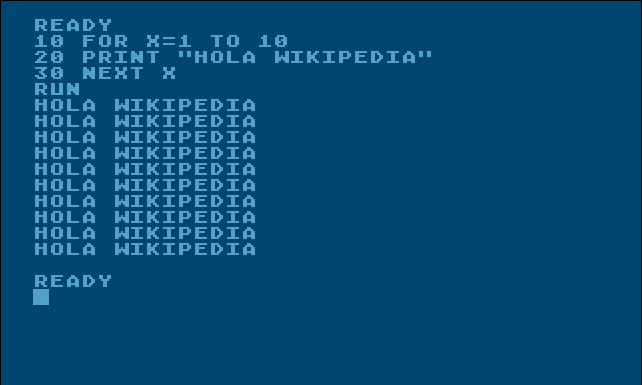

# Basic BASIC

We have a developed a language similar to BASIC, only simpler. We have therefore
decided to name it *Basic BASIC*, but it needs an interpreter before it can be
shared with the rest of the world. A *Basic BASIC* program consists of several
lines, all of which are on one of the following forms:

* `LET x = e` assigns the value of an expression `e` to a variable `x`. This is also used to declare and instantiate variables.
* `PRINT x` prints the value of a variable `x` to stdout.
* `JUMP n` resumes execution from line number `n`.
* `CONDJUMP n b` resumes execution from line numer `n` if the boolean expression `b` evaluates to true. Otherwise execution continues from the next line.
* `END` exits the program. The last line of any *Basic BASIC* program must always be `END`.

The expressions `e` can contain integers, variables, parentheses and the operators +, - and \*.
For boolean expressions it is only allowed to use < or > between normal expressions, i.e., `b`
is either on the form `e < e` or `e > e`. Also note that the line number `n` in a `JUMP`/`CONDJUMP`
statement refers to the actual line in the source code and not a number given by the
programmer, as it does in normal BASIC.

Consider the meaningless and relatively basic *Basic BASIC* program in [this file](./input).
What is its output? There is only one print statement in the entire program, and
you may assume that it is both syntactically and semantically correct.
