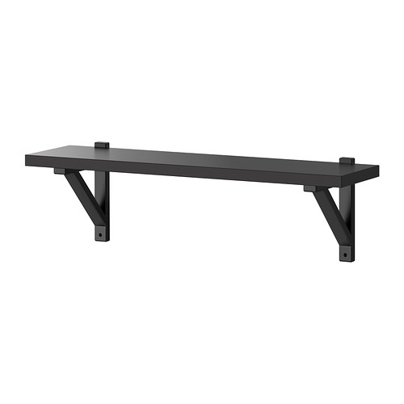

# Bookshelf problem

Professor C. Ompsci is about to move into his new apartment, but needs somewhere
to place all his precious books about computer science. He has taken a liking
to (this shelf from IKEA)[https://www.ikea.com/no/no/catalog/products/S39007500/],
but isn't quite sure how many of them he will need.

He has given you (this file)[./input], which contains a list of each book's
thickness as an integer. Professor Ompsci has assured you that none of his
books are too large to fit on a single shelf. Moreover, he plans to put all the
books and shelves in a particular order. You must therefore assume that if book
`X` comes before book `Y` in the file, one of the following must hold:

1. `X` is the book before `Y` on the same shelf.
2. `X` is the last book on a shelf, and `Y` is the first book on the next shelf.

Can you help the professor calculate how many shelves he will need, if he
decides to buy the above type of shelf? Give your answer as a single integer.
