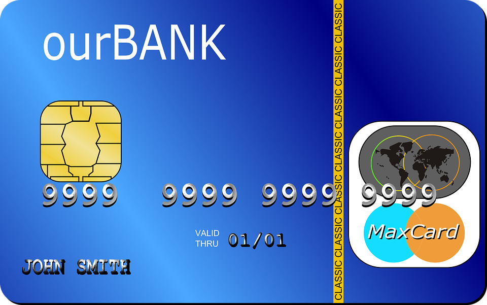

# Credit Card Challenge

The MAPS-team recently decided to start their own bank.
As a service to their customers, the Bank of MAPS will issue credit cards. 
Each credit card will have a unique n-digit card-number. Furthermore, each card-number will be unique "up to one digit-errors". This implies that if a customer enters their card-number with one digit wrong, the money will not be transferred to another account, because the entered card-number will not be in use.
Also, the Bank of MAPS will not create card-numbers that begin with a 0.

Example:(n=2)  
Alice has card-number 12. If she wrongly enters 13 as her card-number, the transfer should be rejected. Thus the Bank of MAPS must make sure that 10,11,13,14,15,16,17,18,19,22,32,42,52,62,72,82 and 92 are not the card-numbers of any other customers.

There current population of Norway is approximately 5 343 035.
The Bank of MAPS has made sure that every Norwegian can get their own credit card, while keeping the number of digits on each card as small as possible. That, is they have calculated n: the minimal number of digits each card-number must have for the above-mentioned criteria to be met. However, they have cards to spare, so they would like to include a second country to which they offer their services. What is the upper limit of the population of the second country?
