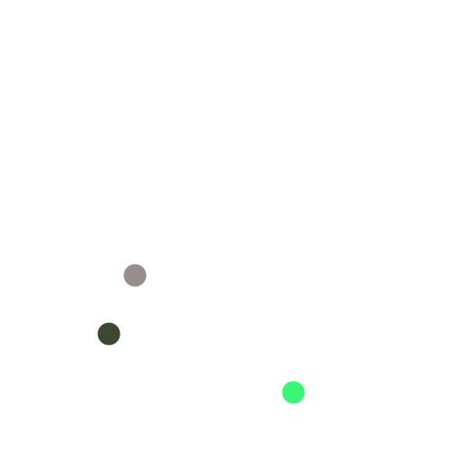
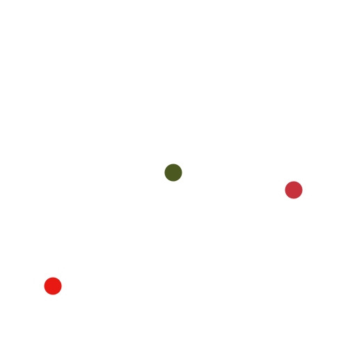

# Dots

The following six images have a property **A**:

<table>
  <tr>
    <td>
      
    </td>
    <td>
      
    </td>
  </tr>
  <tr>
    <td>
      
    </td>
    <td>
      
    </td>
  </tr>
  <tr>
    <td>
      
    </td>
    <td>
      
    </td>
  </tr>
</table>

The following six images have a property **B**:

<table>
  <tr>
    <td>
      
    </td>
    <td>
      
    </td>
  </tr>
  <tr>
    <td>
      
    </td>
    <td>
      
    </td>
  </tr>
  <tr>
    <td>
      
    </td>
    <td>
      
    </td>
  </tr>
</table>

None of the images satisfies both property **A** and **B**. All of the following images has either property **A** or **B**:

<table>
  <tr>
    <td>
    

      
      
 1 

    

    </td>
    <td>
    

      
      
 2 

    

    </td>
  </tr>
  <tr>
    <td>
    

      
      
 3 

    

    </td>
    <td>
    

      
      
 4 

    

    </td>
  </tr>
  <tr>
    <td>
    

      
      
 5 

    

    </td>
    <td>
    

      
      
 6 

    

    </td>
  </tr>
</table>

For every image 1--6, does it satisfy **A** or **B**? Provide the answer as a comma-separated list of `number:property`. For instance, if the three first satisfies **A** and the three last satisfies **B**, then the answer is `1:A,2:A,3:A,4:B,5:B,6:B`.
