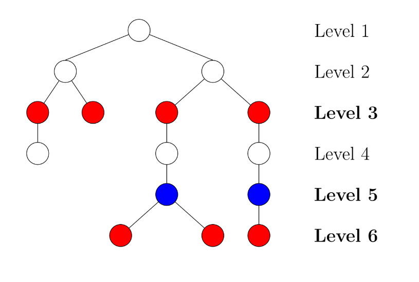

# Fizz Buzz, tree edition



Fizz Buzz is a child's game turned into an infamous programming problem, which
is being used by all the top companies to find the very best candidates in a job
interview. In the standard version of Fizz Buzz, you start counting upwards from
1, but you replace numbers divisible by 3 with "Fizz" and numbers divisible by 5
with "Buzz". Numbers divisible by both 3 and 5 become "Fizz Buzz". For example,
counting up to 20 would produce the following sequence, where "Fizz" occurs
6 times and "Buzz" occurs 4 times:

```
1, 2, Fizz, 4, Buzz, Fizz, 7, 8, Fizz, Buzz, 11, Fizz, 13, 14, Fizz Buzz, 16, 17, Fizz, 19, Buzz
```

We have developed a new amazing version of FizzBuzz, which surely will help
software engineering companies around the world in their hiring process. In this
version we give you a tree, and you will have to say "Fizz" for each node on a
level divisible by 3, while saying "Buzz" for each node on a level divisible by 5.
Of course, an interview would take forever if the graph is very large, so we
allow you to instead just count the number of occurrences for each word.

Input starts with a number `n`, which is the number of nodes in the tree.
Afterwards, `n-1` lines follow, each on the form `x y`. This line says that
`x` is the parent of `y`, i.e., there is a path from `x` to `y` in the tree.
Both `x` and `y` are numbers in the range `[0,n)`.

The root is always identified by the number `0`, and the root is on level 1,
the root's children are on level 2, etc. The tree in the [input file](./input)
happens to be binary, but this should not affect your solution.

On the right is an example of a tree, with 7 ocurrences of "Fizz" (red nodes),
and 2 occurrences of "Buzz" (blue nodes). An input file corresponding to this
figure can be found [here](./example_input).

Give your answer on the form `F B`, where `F` is the number of fizzes and `B`
is the number of buzzes.
